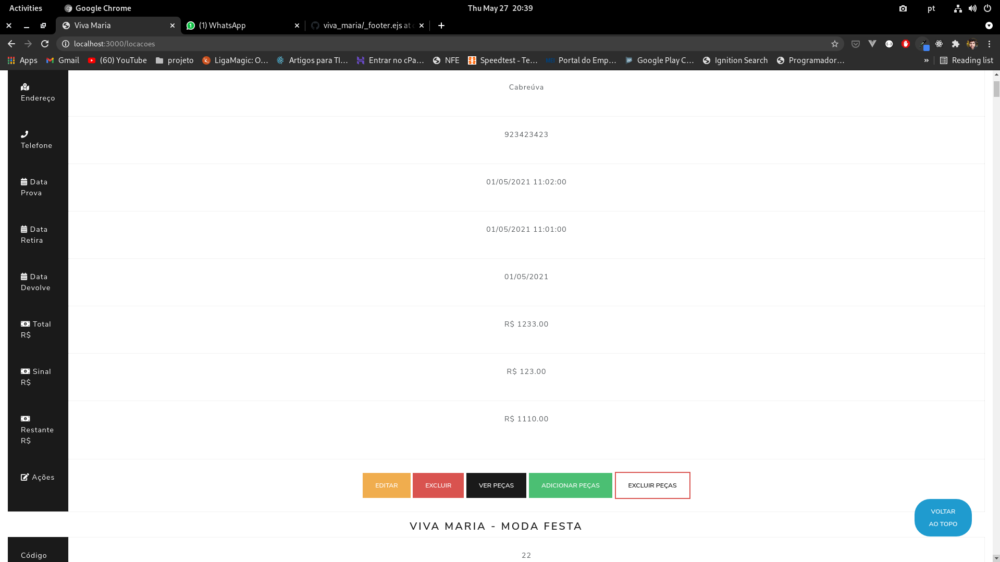
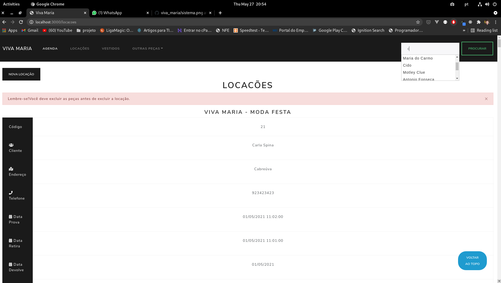
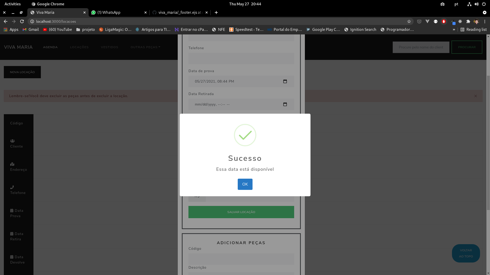
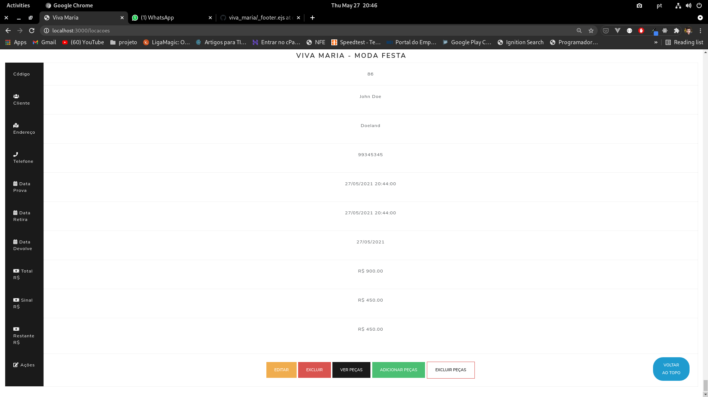
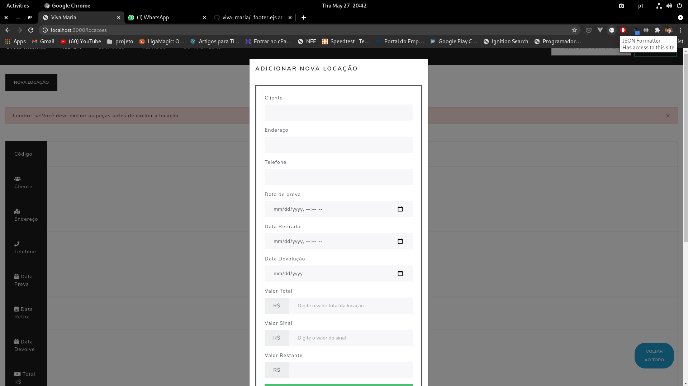
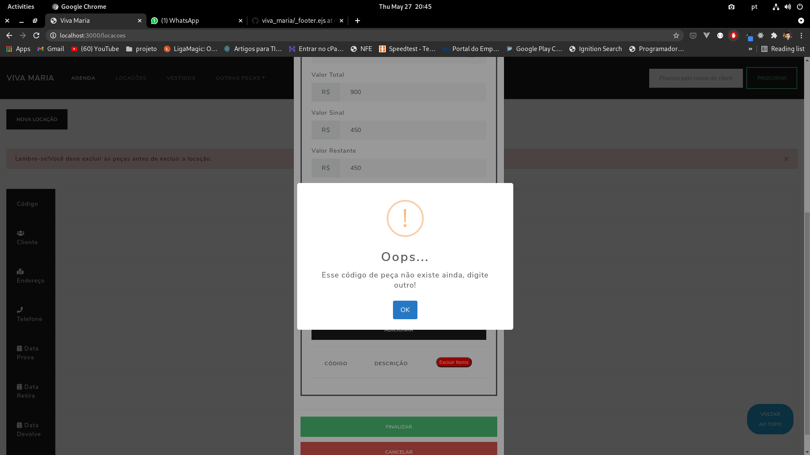
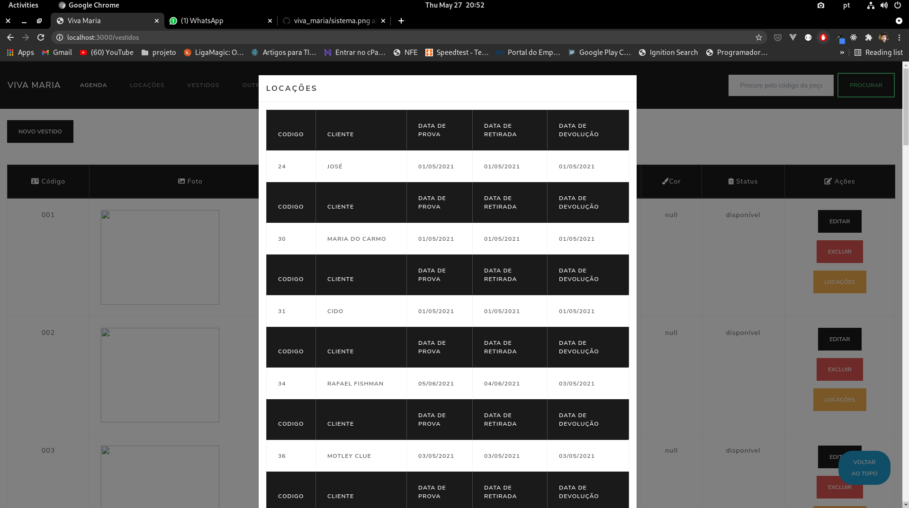

# Viva Maria - Sistema
Sistema para cadastro de peças de roupas e locação com agenda integrada.

# Sistema populado

# Autocomplete para pesquisa de clientes

# Aviso

# Cadastro de locação

# Locacação

# Validações

# Pesquisa de Locações

# Usefull Commands
- to init mysql: `mysql -u root -p`
- cd src
- npm install
- node app.js

# links
- [bootstrap 4 theme](https://stackpath.bootstrapcdn.com/bootswatch/4.5.2/lux/bootstrap.min.css)
# sistema_vestidos
